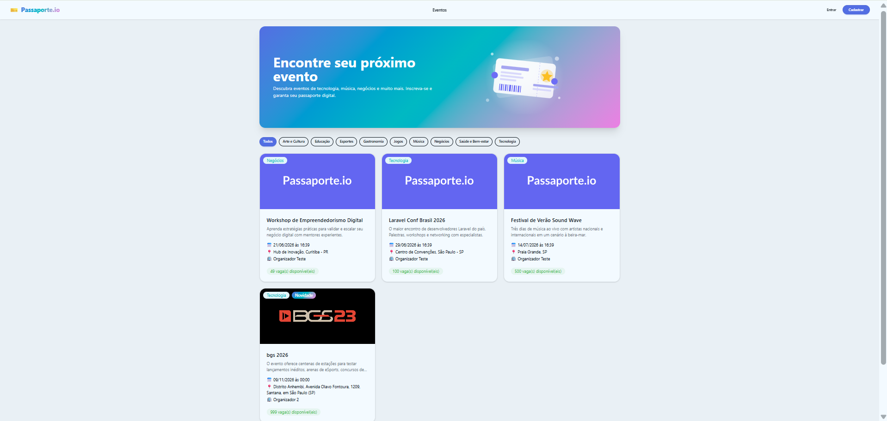
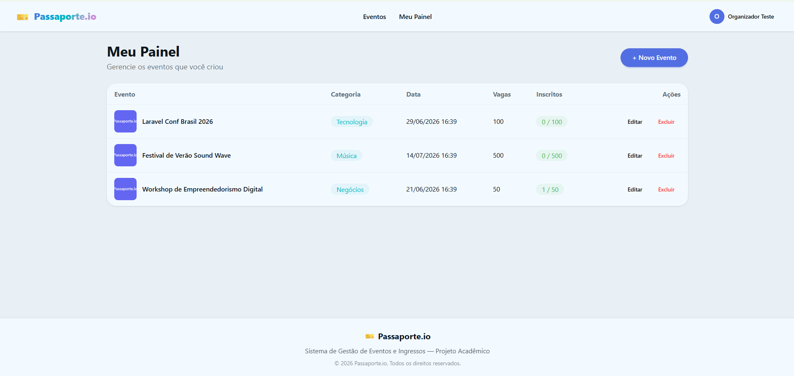
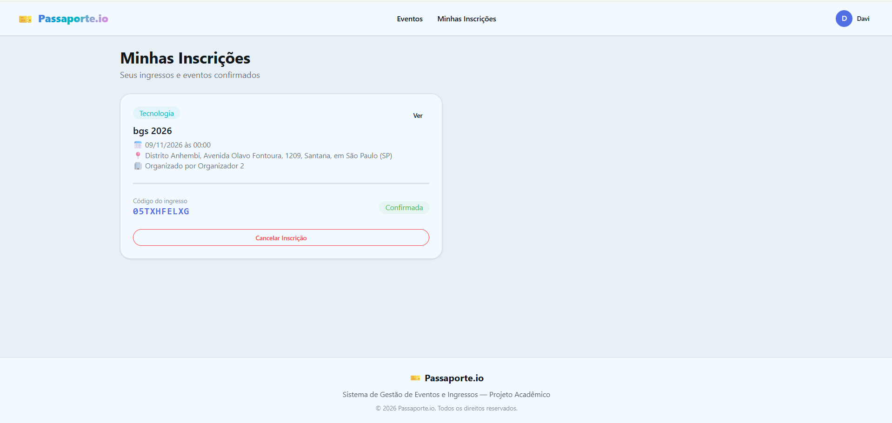

# 🎫 Passaporte.io

Sistema de Gestão de Eventos e Ingressos desenvolvido em **Laravel** com **MySQL** e **DaisyUI/Tailwind CSS**, como projeto avaliativo da disciplina de Programação Web III.

##  Sobre o Projeto

O Passaporte.io é uma plataforma MVP que conecta **Organizadores de eventos** e **Participantes**, oferecendo:

- Portal público de descoberta de eventos com filtro por categoria
- Mecanismo de inscrição seguro com geração de passaporte digital (ticket code único)
- Backoffice completo para organizadores gerenciarem seus eventos

##  Requisitos de Ambiente

- **PHP**: ^8.2
- **Laravel**: 12.x
- **Composer**: 2.x
- **Node.js / NPM**: 18+ (para Tailwind/DaisyUI via Vite)
- **Banco de dados**: MySQL 8.x (via XAMPP)
- **Servidor local**: XAMPP (Apache + MySQL)

##  Passo a Passo de Instalação

### 1. Clonar o repositório

```bash
git clone https://github.com/MiguelHelen/Atividades-do-3Ds---AMS--2026.git
cd Atividades-do-3Ds---AMS--2026/Programação WEB 3/2 Bimestre/passaporte-io
```

### 2. Instalar dependências PHP

```bash
composer install
```

### 3. Instalar dependências JS

```bash
npm install
```

### 4. Configurar variáveis de ambiente

Copie o arquivo de exemplo e gere a chave da aplicação:

```bash
cp .env.example .env
php artisan key:generate
```

Edite o `.env` e configure o banco de dados (valores padrão do XAMPP):

```env
DB_CONNECTION=mysql
DB_HOST=127.0.0.1
DB_PORT=3306
DB_DATABASE=passaporte_io
DB_USERNAME=root
DB_PASSWORD=
```

### 5. Criar o banco de dados

No phpMyAdmin (ou via terminal MySQL), crie um banco vazio chamado `passaporte_io`:

```sql
CREATE DATABASE passaporte_io;
```

### 6. Criar o link simbólico do storage (uploads)

```bash
php artisan storage:link
```

> Necessário para que os banners de eventos enviados (uploads) sejam acessíveis publicamente, sem expor a estrutura real de pastas do servidor (RNF08).

### 7. Rodar Migrations + Seeders

```bash
php artisan migrate --seed
```

Esse comando cria toda a estrutura do banco (tabelas `users`, `categories`, `events`, `event_user`) e popula automaticamente:

- 9 categorias (Tecnologia, Música, Negócios, Educação, Esportes, Gastronomia, Jogos, Saúde e Bem-estar, Arte e Cultura)
- 2 usuários de teste (1 Organizador, 1 Participante)
- 3 eventos de exemplo

> Caso precise resetar o banco do zero: `php artisan migrate:fresh --seed`

### 8. Compilar os assets (Tailwind/DaisyUI)

Para desenvolvimento (hot reload):

```bash
npm run dev
```

Para produção:

```bash
npm run build
```

### 9. Iniciar o servidor

```bash
php artisan serve
```

Acesse: **http://127.0.0.1:8000**

## 🔑 Credenciais de Teste

| Perfil | E-mail | Senha |
|---|---|---|
| Organizador | organizador@passaporte.io | password |
| Participante | participante@passaporte.io | password |

Essas contas já vêm criadas pelo `UserSeeder`, permitindo testar imediatamente a matriz de controle de acesso (ACL) sem necessidade de novos cadastros.

## 🗂️ Estrutura do Banco de Dados (ERD)

- **users**: id, name, email, password, role (`participante` | `organizador`)
- **categories**: id, name
- **events**: id, user_id (FK organizador), category_id (FK), title, description, date_time, location, capacity, banner_path
- **event_user** (tabela pivô): id, user_id (FK participante), event_id (FK), ticket_code, status

##  Funcionalidades Implementadas

### Autenticação e ACL
- Registro com escolha de perfil (Participante / Organizador)
- Login / Logout com sessão segura
- Middlewares de proteção: `auth`, `organizador`, `participante`
- Isolamento de propriedade (RN09): organizador só edita/exclui seus próprios eventos

### Backoffice do Organizador
- CRUD completo de eventos com upload de banner (até 2MB, apenas imagens)
- Validação de data retroativa (RN01)
- Bloqueio de exclusão de eventos com inscritos (RN03)
- Listagem paginada (RNF05)

### Motor de Inscrições
- Geração automática de `ticket_code` alfanumérico único (RF09)
- Bloqueio de inscrição duplicada (RN04)
- Controle de capacidade/lotação em tempo real (RN05)
- Bloqueio de auto-inscrição para organizadores (RN06)
- Histórico de inscrições com cancelamento (RF10, RF11)

### Vitrine Pública
- Listagem de eventos futuros com eager loading (RNF04 - sem N+1)
- Filtro por categoria (RF13)
- Tela de detalhes do evento (RF14)
- Badge "Novidade" para eventos criados há menos de 3 horas

##  Segurança

- Senhas com hash bcrypt nativo (RNF03)
- Proteção CSRF em todos os formulários (RNF07)
- Eloquent ORM (Query Binding) contra SQL Injection (RNF06)
- Uploads com nomes ofuscados via hash (RNF09)
- Mensagens flash padronizadas com DaisyUI (`alert-success` / `alert-error`) (RNF10)
- Preservação de dados em formulários com erro de validação (RNF11)

## Projeto 

Projeto acadêmico — Programação Web III

## 📸 Capturas de Tela

### Vitrine Pública


### Painel do Organizador


### Minhas Inscrições

