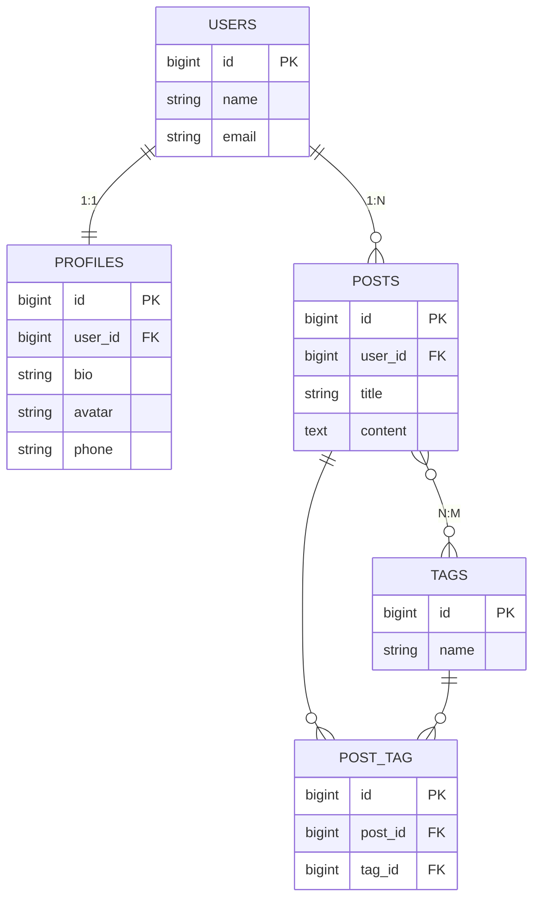

# AMS Laravel DB — Migrations e Relacionamentos

Projeto Laravel desenvolvido para demonstrar a criação de um banco de dados relacional
via **Migrations**, cobrindo as três cardinalidades de relacionamento exigidas na
atividade: **1:1**, **1:N** e **N:M**.

---

##  Estrutura do banco de dados (`ams_laravel_db`)

O banco é composto por 5 tabelas, escolhidas especificamente para representar cada
tipo de cardinalidade:

| Tabela      | Cardinalidade                  | Descrição                                                    |
|-------------|---------------------------------|----------------------------------------------------------------|
| `users`     | —                                | Tabela principal, representa os usuários do sistema.           |
| `profiles`  | **1:1** com `users`              | Cada usuário possui exatamente **um** perfil associado.        |
| `posts`     | **1:N** com `users`              | Um usuário pode criar **vários** posts.                        |
| `tags`      | **N:M** com `posts`              | Uma tag pode estar associada a **vários** posts.                |
| `post_tag`  | Tabela pivô do relacionamento N:M | Liga as tabelas `posts` e `tags`.                              |

### Diagrama entidade-relacionamento (ER)



### Como cada cardinalidade foi garantida

- **1:1 — `users` ↔ `profiles`**
  A coluna `profiles.user_id` foi definida como **`unique()`** na migration.
  Isso impede que um mesmo usuário tenha mais de um perfil vinculado.

- **1:N — `users` ↔ `posts`**
  A coluna `posts.user_id` **não é única**, apenas uma chave estrangeira comum.
  Isso permite que um mesmo usuário tenha vários posts associados a ele.

- **N:M — `posts` ↔ `tags`**
  Foi criada explicitamente a tabela pivô **`post_tag`**, contendo as chaves
  estrangeiras `post_id` e `tag_id`, com uma restrição `unique(['post_id', 'tag_id'])`
  para evitar duplicidade da mesma tag em um mesmo post.

Todas as chaves estrangeiras foram geradas com `constrained()->onDelete('cascade')`,
o que faz o Laravel criar automaticamente, no MySQL, as constraints
`CONSTRAINT ... FOREIGN KEY` e os índices correspondentes — sem necessidade de
escrever SQL manualmente.

---

## ⚙️ Como rodar o projeto localmente

```bash
# 1. Clonar o repositório
git clone <link-do-repositorio>
cd ams-laravel-db

# 2. Instalar as dependências
composer install

# 3. Configurar o .env
cp .env.example .env
php artisan key:generate

# 4. Criar o banco de dados vazio "ams_laravel_db" no MySQL local

# 5. Rodar as migrations
php artisan migrate
```

---

##  Comandos Artisan usados para criar as migrations

```bash
php artisan make:migration create_profiles_table
php artisan make:migration create_posts_table
php artisan make:migration create_tags_table
php artisan make:migration create_post_tag_table
```

---

## 📁 Estrutura relevante do repositório

```
├── app/Models/
│   ├── User.php
│   ├── Profile.php
│   ├── Post.php
│   └── Tag.php
├── database/migrations/
│   ├── 0001_01_01_000000_create_users_table.php
│   ├── 2024_01_01_000001_create_profiles_table.php
│   ├── 2024_01_01_000002_create_posts_table.php
│   ├── 2024_01_01_000003_create_tags_table.php
│   └── 2024_01_01_000004_create_post_tag_table.php
├── database_schema.sql   ← dump da estrutura completa do banco, exportado após o migrate
├── .env.example
└── README.md
```

---

## 📄 Sobre o `database_schema.sql`

O arquivo `database_schema.sql`, na raiz deste repositório, contém o **dump completo
da estrutura** do banco `ams_laravel_db`, exportado via phpMyAdmin após a execução do
`php artisan migrate`. Nele é possível encontrar as linhas de SQL nativo geradas
automaticamente pelo Laravel a partir das migrations em PHP, como por exemplo:

```sql
CONSTRAINT `posts_user_id_foreign` FOREIGN KEY (`user_id`) REFERENCES `users` (`id`) ON DELETE CASCADE
```
