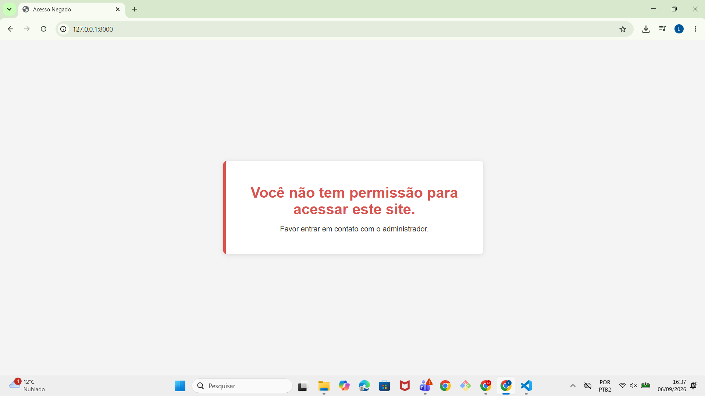
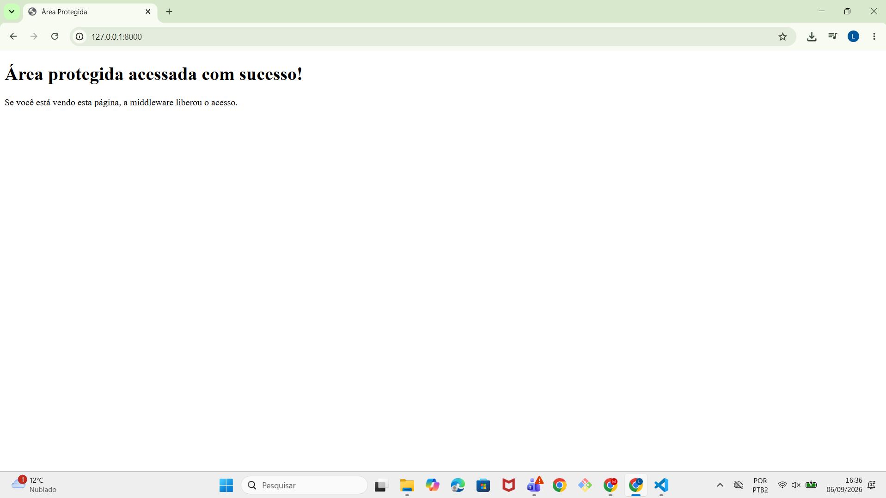

# Laravel - Middlewares e Model

Projeto onde o **Controller** é protegido por uma **Middleware**.
Quando o acesso não é permitido, a middleware intercepta a requisição e
retorna a view abaixo, sem que o controller chegue a ser executado:

> **Você não tem permissão para acessar este site.**
> **Favor entrar em contato com o administrador.**

---

## Estrutura do projeto

```
app/Http/Middleware/CheckAccessMiddleware.php   -> lógica da middleware
app/Http/Controllers/SiteController.php         -> controller protegido
resources/views/acesso-negado.blade.php         -> view exibida quando bloqueado
resources/views/site/index.blade.php            -> view exibida quando permitido
routes/web.php                                  -> rota usando a middleware
```

---

## Passo a passo de instalação

### 1. Criar o projeto Laravel
```bash
composer create-project laravel/laravel laravel-middleware-demo
cd laravel-middleware-demo
```

### 2. Criar a middleware
```bash
php artisan make:middleware CheckAccessMiddleware
```
O conteúdo gerado deve ser substituído pelo arquivo `CheckAccessMiddleware.php`
deste projeto.

### 3. Criar o controller
```bash
php artisan make:controller SiteController
```
O conteúdo gerado deve ser substituído pelo arquivo `SiteController.php`
deste projeto.

### 4. Registrar a middleware

**Laravel 11 ou 12** (arquivo `bootstrap/app.php`):
```php
->withMiddleware(function (Middleware $middleware) {
    $middleware->alias([
        'check.access' => \App\Http\Middleware\CheckAccessMiddleware::class,
    ]);
})
```

**Laravel 10 ou anterior** (arquivo `app/Http/Kernel.php`):
```php
protected $middlewareAliases = [
    // ...outras middlewares
    'check.access' => \App\Http\Middleware\CheckAccessMiddleware::class,
];
```

### 5. Copiar as views
Os arquivos `acesso-negado.blade.php` e a pasta `site/` devem ser copiados
para dentro de `resources/views/`.

### 6. Copiar a rota
O conteúdo de `routes/web.php` do projeto deve ser copiado para o
`routes/web.php` do projeto Laravel.

---

## Como executar o projeto

```bash
php artisan serve
```

Endereço de acesso:
```
http://127.0.0.1:8000
```

---

## Execuções da middleware


1. **Execução 1 - Acesso negado (cenário padrão)**
   Com a variável `$temPermissao = false;` na middleware, o acesso à rota
   `http://127.0.0.1:8000` exibe a mensagem de bloqueio.

   

2. **Execução 2 - Acesso permitido**
   Alterando a variável para `$temPermissao = true;` e atualizando a página,
   o controller é executado normalmente e a página protegida é exibida.

   

