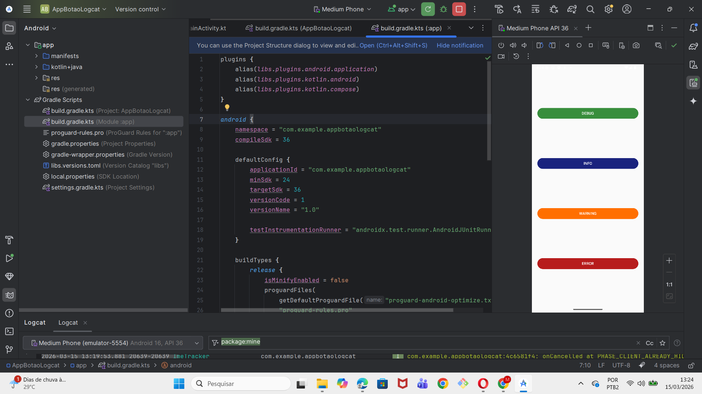
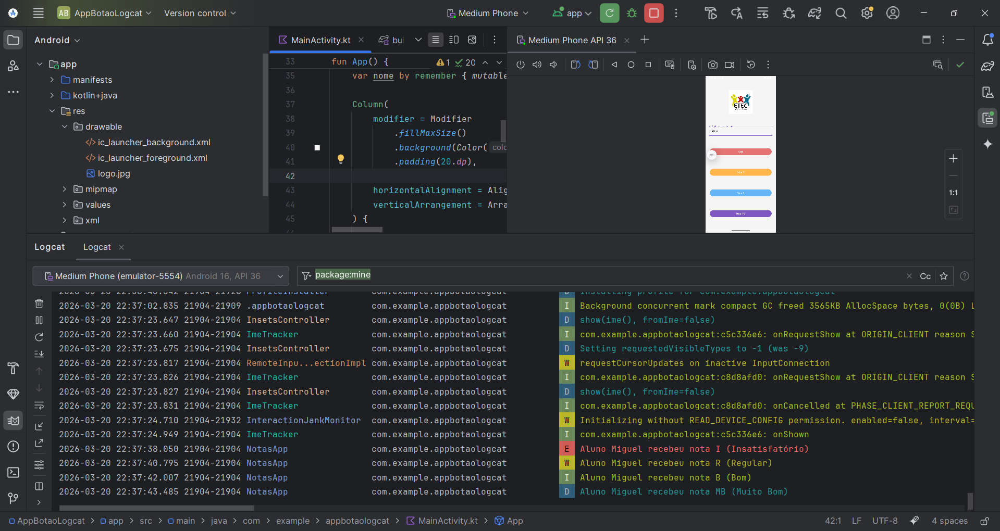

# 📱 Aplicativo Android - Botões e Logcat

##  Sobre a atividade

Este projeto foi desenvolvido como atividade da disciplina de **Programação de Aplicativos Mobile**.

O objetivo da atividade é criar um aplicativo Android utilizando **Kotlin e Jetpack Compose**, contendo **quatro botões** que registram mensagens diferentes no **Logcat** do Android Studio.

Cada botão representa um nível de log utilizado no desenvolvimento Android para depuração e monitoramento do funcionamento do aplicativo.

---

##  Objetivo

Criar um aplicativo simples que demonstre o uso de diferentes tipos de **logs no Android**, permitindo visualizar mensagens no **Logcat** ao clicar nos botões da interface.

Os níveis de log utilizados foram:

* **DEBUG**
* **INFO**
* **WARNING**
* **ERROR**

---

## 🛠️ Tecnologias utilizadas

* **Android Studio**
* **Kotlin**
* **Jetpack Compose**
* **Logcat (Android)**

---

## 📱 Funcionalidades do aplicativo

O aplicativo possui **quatro botões**, cada um responsável por gerar um tipo diferente de mensagem no Logcat.

| Botão   | Função                          |
| ------- | ------------------------------- |
| DEBUG   | Envia uma mensagem de depuração |
| INFO    | Envia uma mensagem informativa  |
| WARNING | Envia um aviso                  |
| ERROR   | Simula um erro no aplicativo    |

Quando o usuário pressiona um botão, uma mensagem correspondente é exibida no **Logcat**, permitindo ao desenvolvedor acompanhar o comportamento do aplicativo.

---

## ▶️ Como executar o projeto

1. Abrir o projeto no **Android Studio**
2. Sincronizar o projeto com o Gradle
3. Executar o aplicativo em um **emulador** ou **dispositivo físico**
4. Abrir a aba **Logcat**
5. Filtrar pelo TAG:

```
TestAndroid
```

6. Clicar nos botões do aplicativo para visualizar as mensagens de log.

---

## 🖥️ Interface do aplicativo

A interface foi desenvolvida utilizando **Jetpack Compose**, contendo quatro botões organizados verticalmente na tela.

Cada botão possui uma cor diferente para facilitar a identificação da ação executada.

---

## 📸 Prints da execução

### Interface do aplicativo


```

```

---

### Execução no Logcat


```

```

---


