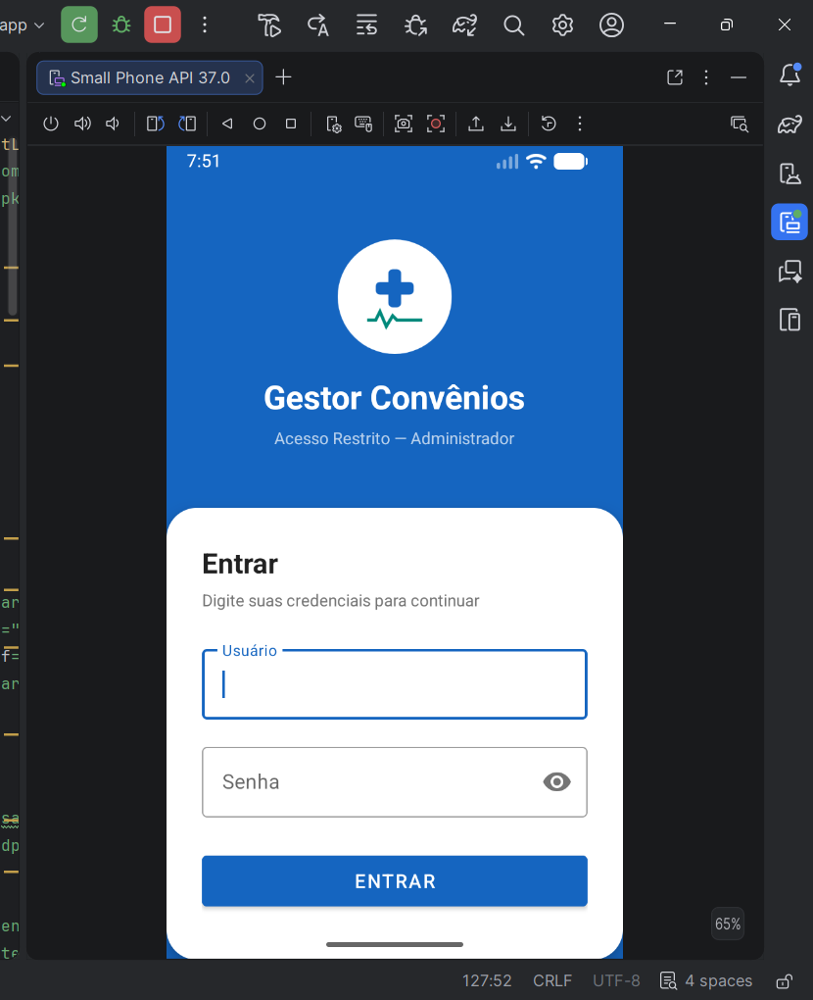
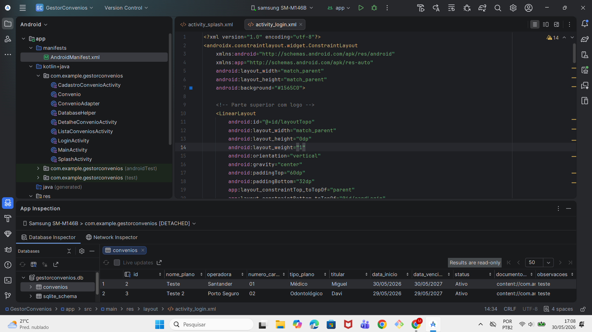

# 📱 Gestor Convênios

## 📖 Sobre o projeto

O Gestor Convênios é um aplicativo Android desenvolvido para gerenciamento de convênios médicos e odontológicos.

O sistema permite cadastrar, visualizar, editar e excluir convênios, além de possibilitar o vínculo de documentos em PDF ou imagens utilizando URIs do Android.

O projeto foi desenvolvido utilizando Kotlin e banco de dados local SQLite.

---

## 🎯 Objetivo

Criar um aplicativo Android completo utilizando conceitos de:

* CRUD com SQLite
* RecyclerView
* Manipulação de arquivos com URI
* Navegação entre telas
* Interface moderna com Material Design

---

## 🛠️ Tecnologias utilizadas

* Android Studio
* Kotlin
* SQLite
* RecyclerView
* CardView
* Material Design 3
* ViewBinding
* FileProvider

--- 

## 📱 Funcionalidades do aplicativo

Funcionalidade |	Descrição
Cadastro       |	Cadastro de convênios
Edição         |	Alteração de informações
Exclusão       | 	Remoção de convênios
Busca          |	Pesquisa em tempo real
Status         |	Controle de situação do convênio
Documentos     |	Vinculação de PDF e imagens
URI            |    Persistência de acesso aos arquivos

---

## Estrutura de Arquivos

```
GestorConvenios/
├── app/src/main/java/com/example/gestorconvenios/
│   ├── SplashActivity.kt           # Tela de abertura do aplicativo
│   ├── LoginActivity.kt            # Autenticação do administrador
│   ├── MainActivity.kt             # Menu principal com navegação
│   ├── ListaConveniosActivity.kt   # Listagem e busca de convênios
│   ├── CadastroConvenioActivity.kt # Cadastro e edição de convênios
│   ├── DetalheConvenioActivity.kt  # Detalhes e documento URI
│   ├── Convenio.kt                 # Data class do modelo de dados
│   ├── DatabaseHelper.kt           # Banco de dados SQLite (CRUD)
│   └── ConvenioAdapter.kt          # Adapter do RecyclerView
├── app/src/main/res/
│   ├── layout/
│   │   ├── activity_splash.xml         # Layout da splash screen
│   │   ├── activity_login.xml          # Layout da tela de login
│   │   ├── activity_main.xml           # Layout do menu principal
│   │   ├── activity_lista_convenios.xml    # Layout da listagem
│   │   ├── activity_cadastro_convenio.xml  # Layout do formulário
│   │   ├── activity_detalhe_convenio.xml   # Layout do detalhe
│   │   └── item_convenio.xml           # Layout do item da lista
│   ├── drawable/
│   │   ├── ic_logo_saude.xml           # Logo cruz médica
│   │   ├── ic_back.xml                 # Ícone de voltar
│   │   ├── bg_inicial.xml              # Círculo colorido da lista
│   │   ├── bg_search.xml               # Fundo da barra de busca
│   │   ├── bg_doc_uri.xml              # Fundo do campo de documento
│   │   ├── bg_spinner.xml              # Fundo do seletor de status
│   │   └── bg_status_white.xml         # Badge de status
│   ├── values/
│   │   ├── colors.xml      # Paleta de cores do app
│   │   ├── strings.xml     # Textos e labels
│   │   └── themes.xml      # Tema Material Design 3
│   └── xml/
│       └── file_paths.xml  # Configuração do FileProvider
└── app/src/main/AndroidManifest.xml    # Configuração e permissões
```

---


## ▶️ Como executar o projeto


Pré-requisitos

Android Studio Ladybug ou Meerkat (2024–2025)
JDK 11 ou superior
Android SDK API 24 ou superior
Dispositivo físico com Android 7.0+ ou emulador configurado

Passo a passo
 1. Clone o repositório
bashgit clone https://github.com/MiguelHelen/GestorConvenios.git
 2. Abra o projeto no Android Studio
File > Open > selecione a pasta GestorConvenios
 3. Aguarde a sincronização do Gradle
O Android Studio vai baixar as dependências automaticamente. Aguarde a mensagem Gradle sync finished na barra inferior.
 4. Conecte um dispositivo ou inicie um emulador
Para dispositivo físico:

Ative o Modo Desenvolvedor no celular (Configurações > Sobre o telefone > toque 7x em Número da versão)
Ative a Depuração USB (Configurações > Opções do desenvolvedor)
Conecte o cabo USB e autorize a depuração no celular

Para emulador:

Acesse Device Manager no Android Studio
Clique em Create Virtual Device
Selecione Pixel 6 com API 34
Inicie o emulador clicando em ▶

5. Execute o aplicativo
Run > Run 'app'   ou   Shift + F10

---

## 📸 Prints do sistema




---
