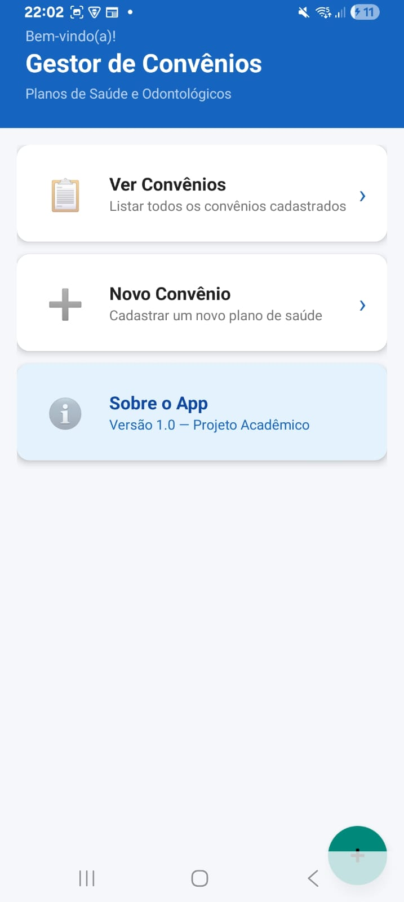

# 📱 Gestor Convênios

## 📖 Sobre o projeto

O Gestor Convênios é um aplicativo Android desenvolvido para gerenciamento de convênios médicos e odontológicos.

O sistema permite cadastrar, visualizar, editar e excluir convênios, além de possibilitar o vínculo de documentos em PDF ou imagens utilizando URIs do Android.

O projeto foi desenvolvido utilizando Kotlin e banco de dados local SQLite.

---

## 🎯 Objetivo

Criar um aplicativo Android completo utilizando conceitos de:

* CRUD com SQLite
* RecyclerView
* Manipulação de arquivos com URI
* Navegação entre telas
* Interface moderna com Material Design

---

## 🛠️ Tecnologias utilizadas

* Android Studio
* Kotlin
* SQLite
* RecyclerView
* CardView
* Material Design 3
* ViewBinding
* FileProvider

--- 

## 📱 Funcionalidades do aplicativo

Funcionalidade |	Descrição
Cadastro |	Cadastro de convênios
Edição |	Alteração de informações
Exclusão| 	Remoção de convênios
Busca |	Pesquisa em tempo real
Status |	Controle de situação do convênio
Documentos |	Vinculação de PDF e imagens
URI| 	Persistência de acesso aos arquivos

---

## ▶️ Como executar o projeto

1. Abrir o projeto no Android Studio
2. Sincronizar o projeto com o Gradle
3. Executar em um emulador ou dispositivo físico
4. Testar as funcionalidades do aplicativo

---

## 📸 Prints do sistema

---
